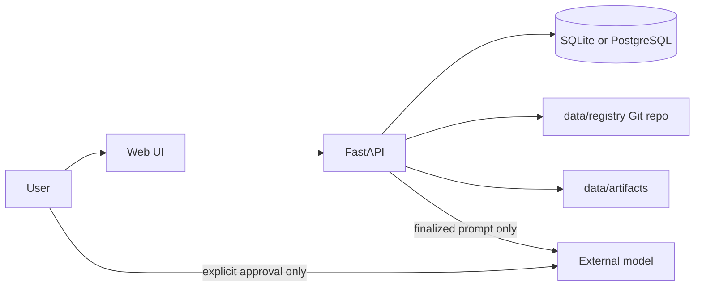

# Prompt Piper Architecture

Prompt Piper is a **local-first prompt engineering workbench**. It helps users design, clarify, edit, finalize, optimize, store, and retrieve prompts on their own machine. It is intentionally **not** a broad autonomous agent platform.

## Design principles

1. **Local by default** — prompts, drafts, registry history, and artifacts stay on the user's machine.
2. **Explicit external calls** — only a finalized, user-approved prompt may be sent to an external model, and only when the user chooses to do so.
3. **Git-backed registry** — durable prompt storage lives in `data/registry` as versioned files.
4. **Progressive complexity** — SQLite supports early local development; PostgreSQL with pgvector supports semantic retrieval later.

## Monorepo layout

```
apps/
  api/          FastAPI backend
  web/          React + Vite frontend
packages/
  shared/       Shared TypeScript types (OpenAPI-generated types can live here)
data/
  registry/     Git-backed prompt registry
  artifacts/    Generated TXT, Markdown, HTML, PDF, bibliography outputs
infra/          Podman Containerfiles and compose manifests
docs/           Architecture and operational documentation
tests/          Backend and integration tests
```

## Runtime components

### API (`apps/api`)

- FastAPI application with Pydantic v2 settings and SQLModel persistence.
- Health endpoint at `GET /health`.
- Database layer abstracts SQLite (dev) and PostgreSQL + pgvector (production-like local setup).

### Web (`apps/web`)

- React + TypeScript + Vite shell.
- TanStack Query for local API communication.
- No SaaS dependency by default.

### Shared package (`packages/shared`)

- Cross-app TypeScript contracts.
- Future home for OpenAPI-generated client types.

## Data flow (high level)



## Future domains (not implemented in scaffold)

- Prompt drafting and clarification workflows
- Versioned registry read/write APIs
- Artifact generation pipeline
- Semantic search via pgvector embeddings
- External model dispatch with audit trail

## Technology choices

| Layer      | Choice                          | Notes                                      |
|-----------|----------------------------------|--------------------------------------------|
| Backend   | Python 3.12+, FastAPI, SQLModel | Pydantic v2 throughout                     |
| Database  | SQLite / PostgreSQL + pgvector  | Switch via `DATABASE_URL`                  |
| Frontend  | React, Vite, TanStack Query     | Local API only by default                  |
| Packaging | npm workspaces + Hatchling      | Repeatable dev and container builds        |
| Containers| Podman                          | Rootless-friendly local deployment         |
